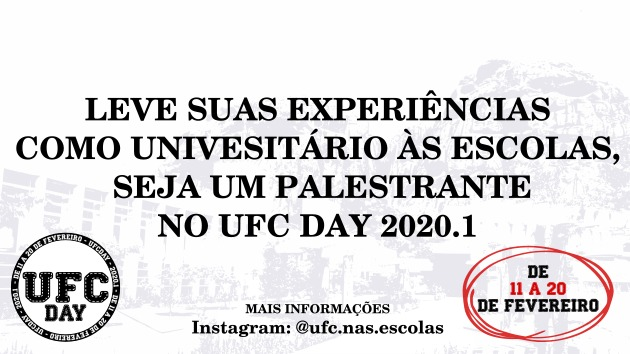

# UFC Day 2020.1
## Embaixadores da Esperança

O UFC Day é um evento promovido pela UFC Quixadá, em que seus alunos, durante o período das férias se voluntariam para visitar escolas de nível médio divulgando a UFC, cursos, bolsas, auxílios e contando sua experiência de universitário. Desde 2017, o evento já alcançou escolas em mais de 30 cidades diferentes.

Mas uma vez, de 11 a 20 de Fevereiro e 2020, o UFC Day vai acontecer. Se você é aluno da UFC Quixadá e quer ser voluntário, se inscreva no formulário online e informe em qual cidade você estará e quais escolas pretende visitar. Sua antiga escola é um ótimo lugar para voltar. Nós vamos entrar em contato, lhe ajudar com treinamento e orientações e indicar outras pessoas da sua cidade que podem ir com você.

Um dos melhores presentes que se pode dar a alguém é esperança. Esse é o caso do Rayrisson Lima de **Jaguaribe**, do José Lucas Amorim de **Pedra Branca**, do David Castro de **Paraipaba**, da Elígia Freitas de **Quixadá** e de tantos outros estudantes que em 2017 e 2018 foram alcançados por esse evento e por causa dele hoje são alunos UFC. Eles estão aqui por você, querido voluntário, que através da sua visita levou não só a UFC, mas levou esperança.

## Links
- [Grupo do Whatsapp para dúvidas](https://chat.whatsapp.com/LGFHJBAU7h4AbYtVGoHZiR)
- [Formulário de Inscrição para Participar como Palentrante]()

## Material de Divulgação
- [Ofício de Solicitação para entregar ao Diretor da Escola](oficio.pdf)

## Material de Apresentação
- [Apresentação Slides]()
- [Banner Benefícios]()
- [Banner Cursos]()
- [Guia de Procedimentos](guia.md)

## Formulário de Feedback
- Embaixador 
- Participante 

## Convite às Escolas

## Escolas Participantes

